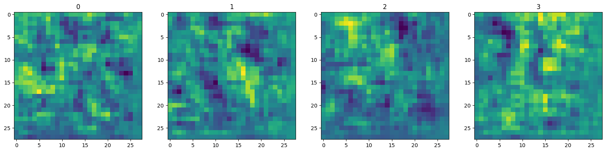
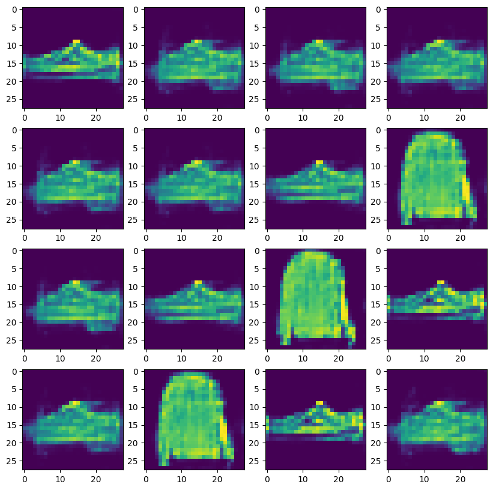

# GANs_Fashion_MNIST

A Generative Adversarial Network (GAN) implementation in **TensorFlow** to generate clothing images from the [Fashion-MNIST dataset]([https://www.tensorflow.org/datasets/catalog/fashion_mnist]), loaded directly via `tensorflow.datasets`.  
The project was developed and trained on **Google Colab**.

##  Example Generated Images

| Training Step | Samples |
|--------------|---------|
| **Initial** |  |
| **After Training** |  |

---

## Project Overview
- **Goal:** Train a GAN to generate Fashion-MNIST style clothing images.
- **Dataset:** Fashion-MNIST (10 classes: T-shirt/top, trousers, pullover, dress, coat, sandal, shirt, sneaker, bag, ankle boot).
- **Architecture:**
  - **Generator:** Converts random noise vectors into 28×28 grayscale images.
  - **Discriminator:** Distinguishes real dataset images from fake ones.
- **Loss Function:** Binary Crossentropy.
- **Optimizer:** Adam.

---

## Requirements
- TensorFlow  
- NumPy  
- Matplotlib  

---

##  How to Run (in Colab)
1. Open the `.ipynb` file in Google Colab.
2. Run all cells to train the GAN.
3. Generated images will be saved during training for progress visualization.

---

## 📚 References
- TensorFlow documentation on GANs.
- Fashion-MNIST dataset in `tensorflow.datasets`.
